# analog-barometer-card

A Home Assistant Lovelace custom card that displays barometric pressure as a
classic analog aneroid barometer — a dial with a needle, the familiar
Stormy / Rain / Change / Fair / Very Dry weather zones, and a pressure trend
indicator (rising / falling / steady) computed from your recorder history.

## Features

- Analog dial rendered in SVG, styled like a classic household barometer
- Needle position maps your sensor's current pressure onto the dial
- Trend arrow (↑ Rising / ↓ Falling / → Steady) plus a small reference tick
  on the rim showing where the needle was a few hours ago — like the manual
  "set" pointer on a real barometer
- Trend is computed from Home Assistant's history API (not just what's been
  observed since the dashboard loaded), so it's correct immediately after a
  page reload
- Supports both hPa/mbar and inHg pressure sensors
- Visual card editor (no YAML required)

## Installation

### HACS (recommended)

1. In HACS, go to **Frontend** → the **⋮** menu → **Custom repositories**.
2. Add this repository URL with category **Lovelace**.
3. Install **Analog Barometer Card** and add the resource when prompted.

### Manual

1. Copy `dist/analog-barometer-card.js` from this repo into your Home Assistant
   `config/www/` directory.
2. In **Settings → Dashboards → Resources**, add a resource:
   - URL: `/local/analog-barometer-card.js`
   - Resource type: JavaScript Module

## Configuration

Add the card via the dashboard UI ("Add Card" → search for "Analog
Barometer") and use the visual editor, or configure it directly in YAML:

```yaml
type: custom:analog-barometer-card
entity: sensor.outdoor_pressure
name: Outdoor Pressure
unit: hPa
trend_hours: 3
trend_threshold: 1.5
face_style: classic
needle_color: "#333333"
```

### Options

| Name              | Type   | Default                          | Description                                                        |
| ----------------- | ------ | --------------------------------- | -------------------------------------------------------------------- |
| `entity`          | string | **required**                      | A `sensor` entity reporting barometric pressure                    |
| `name`             | string | entity's friendly name            | Title shown above the dial                                         |
| `unit`             | string | auto-detected from the entity     | `hPa` or `inHg`                                                    |
| `min`              | number | 950 hPa / 28.0 inHg               | Lower bound of the dial scale                                      |
| `max`              | number | 1050 hPa / 31.0 inHg              | Upper bound of the dial scale                                      |
| `trend_hours`      | number | 3                                 | How many hours back to look up for computing the trend             |
| `trend_threshold`  | number | 1.5 hPa (auto-scaled for inHg)    | Minimum change over `trend_hours` to be considered rising/falling  |
| `face_style`       | string | `classic`                         | Dial appearance: `classic`, `silver`, `dark`, `light`, `led-backlit`, `fluorescent`, or `futuristic` |
| `needle_color`     | string | set per `face_style`              | CSS color for the needle; overrides the face style's default       |

### Face styles

On a light Home Assistant theme:

<table>
<tr>
<td align="center"><code>classic</code><br>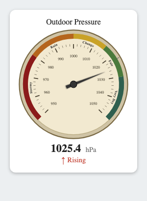</td>
<td align="center"><code>silver</code><br>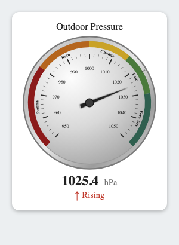</td>
<td align="center"><code>dark</code><br>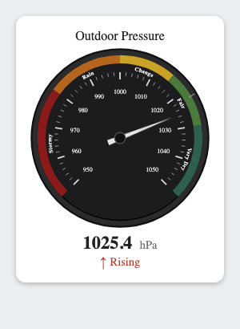</td>
<td align="center"><code>light</code><br>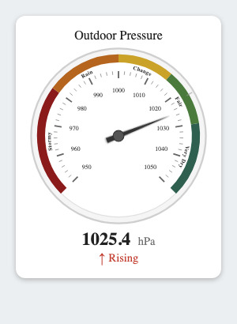</td>
</tr>
<tr>
<td align="center"><code>led-backlit</code><br>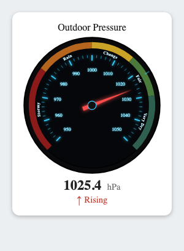</td>
<td align="center"><code>fluorescent</code><br>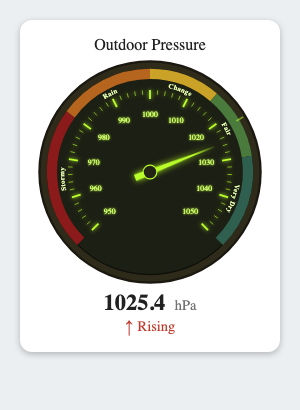</td>
<td align="center"><code>futuristic</code><br>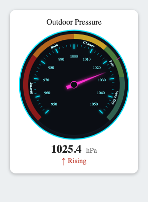</td>
<td></td>
</tr>
</table>

On a dark Home Assistant theme:

<table>
<tr>
<td align="center"><code>classic</code><br>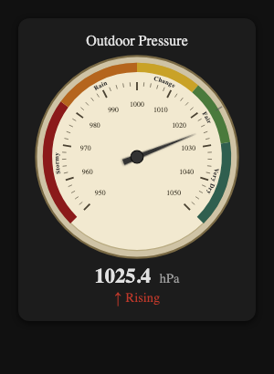</td>
<td align="center"><code>silver</code><br>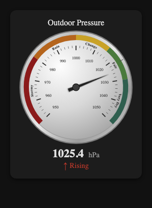</td>
<td align="center"><code>dark</code><br>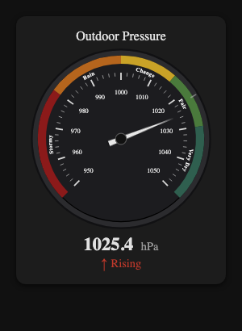</td>
<td align="center"><code>light</code><br>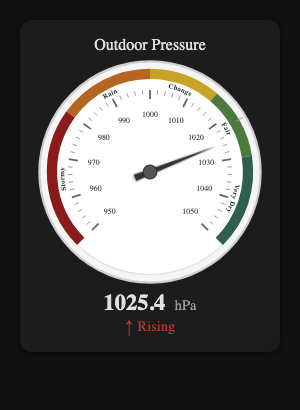</td>
</tr>
<tr>
<td align="center"><code>led-backlit</code><br>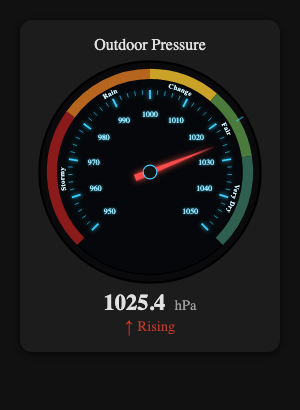</td>
<td align="center"><code>fluorescent</code><br>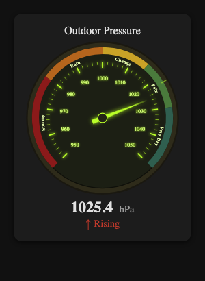</td>
<td align="center"><code>futuristic</code><br>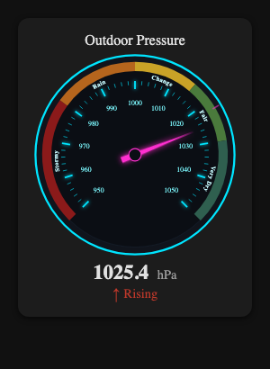</td>
<td></td>
</tr>
</table>

## Development

From the repo root:

```bash
npm install
npm run build       # builds every package, including this one
npm run typecheck
npm run lint
```

See [`dev/gallery.html`](../../dev/gallery.html) at the repo root for a
standalone browser test page (mocked `hass` object, no real Home Assistant
instance required) covering this card alongside the rest of the family.

## License

Apache-2.0 — see [LICENSE](LICENSE).
